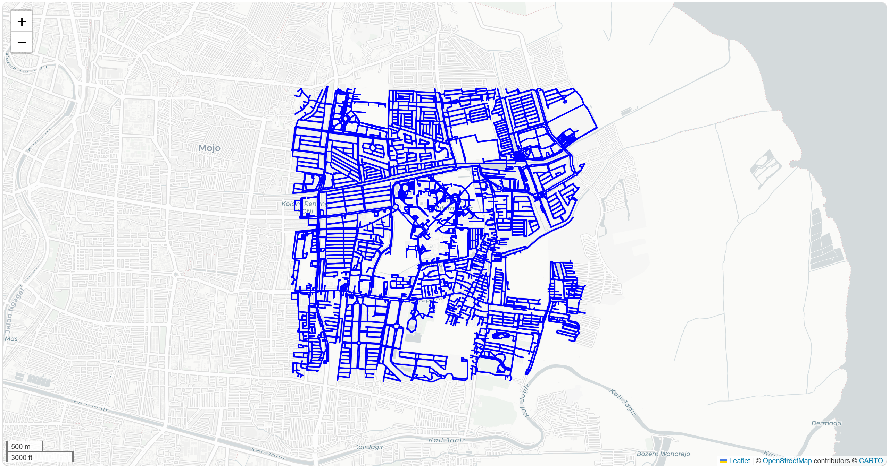

**DAA_Final**

# LaundryLink: Independent Campus Route Optimizer
## Overview
LaundryLink Dispatcher is an algorithmic dispatch and routing engine built for an independent, self-managed student laundry facility operating at ITS. To maximize delivery efficiency and protect profit margins, this system calculates the absolute fastest driving paths between any places around ITS campus.

This project implements and compares two fundamental pathfinding algorithms written entirely from scratch:
1. **Dijkstra's Algorithm:** Serving as the baseline exact solver.
2. **A\* Search Algorithm:** Utilizing a spatial Haversine (great-circle) distance heuristic to aggressively prune the search space and speed up routing calculations.

## The Campus Graph
To realistically simulate our delivery zones, the program builds a vector graph of the real world using OpenStreetMap data. 



In `path.py`, the graph is generated using the following parameter:
`ox.graph_from_address(place_name, dist=2000, network_type='all')`

* **`dist=2000` (The 2km Radius):** This specific radius was chosen because it perfectly encapsulates the entire ITS campus (from the main gate/Bundaran to the deepest engineering departments and the dormitories). Crucially, it also captures the immediate surrounding student housing areas (such as Keputih and Gebang), which represent the core customer base for our independent laundry facility.
* **`network_type='all'`:** Unlike standard car GPS routing, this parameter forces the graph to include pedestrian pathways, service alleys, and campus driveways, ensuring our delivery riders can route directly to the specific dormitory doors or any specific starting point.

## Environment Setup & Installation
To run this project, you need Python 3.8+ installed. It is highly recommended to run this inside an isolated virtual environment to prevent library conflicts.
**1. Download the Repository:**
```
git clone https://github.com/maknaalam/DAA_Final.git
cd DAA_Final
```
**2. Create and activate a virtual environment (Windows/PowerShell):**
```
python -m venv .venv
.\.venv\Scripts\Activate.ps1
```
**3. Install the required dependencies:**
```
pip install osmnx networkx mapclassify folium matplotlib
```
**4. Run the Dispatch Program**
```
python path.py
```

## Input & Output
**Expected Inputs**
The system features an interactive, error-trapped CLI dashboard. It expects human-readable text addresses.<br>

- Pickup Location: such as Asrama Mahasiswa ITS or Bundaran ITS

- Drop-off Location: such as Rektorat ITS, Surabaya or Departemen Teknik Informatika ITS

The geocoder will automatically scan the campus grid, snap your text to the nearest valid GPS intersection (Node ID), and begin the routing algorithms.

**Expected Outputs**
Upon successful execution, the terminal will output the exact microsecond execution time and the total number of intersections traversed for both algorithms. Additionally, the system generates four files in the repository directory:

**Execution Logs:**

- dijkstra_log.txt: Timestamped execution metrics for the baseline algorithm.

-  astar_log.txt: Timestamped execution metrics for the A* heuristic algorithm.

**Interactive Maps:**

- dijkstra_route.html: A draggable map showing Dijkstra's entire explored search space (in translucent blue) and the final optimal route (in solid red).

- astar_route.html: A comparable map demonstrating how the A* heuristic drastically reduces the blue explored search space by aiming directly at the target.
